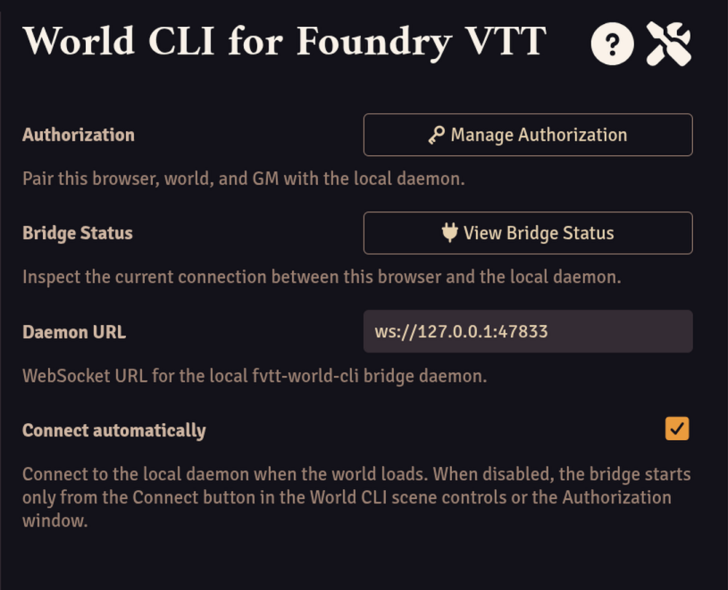
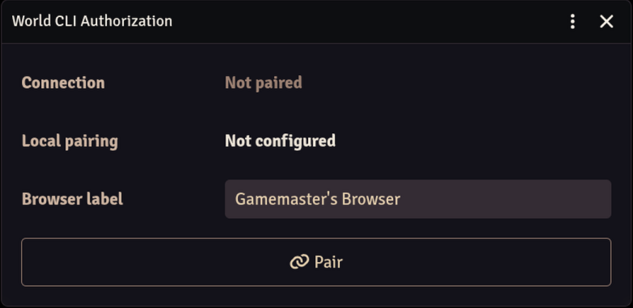

# Getting started

This walkthrough covers the first run in detail: starting the daemon, pairing a Foundry GM client,
and confirming the bridge, with what to expect at each step and what to do when something deviates.

## 1. Start the daemon

```bash
fvtt-world-cli bridge serve
```

The daemon is the meeting point of the other two parts: the Foundry module connects to it, the CLI
sends commands to it, and it routes each command into the GM session. It listens on
`ws://127.0.0.1:47833` unless overridden and stays running in the foreground for as long as the
tool is in use.

The daemon should be running before the Foundry GM client loads the world: the module tries to
connect once when the world loads, and if the daemon is down at that moment it gives up with a
warning. Connecting after that is a manual retry — Connect in the scene controls, or a client
reload.

## 2. Pair the Foundry GM client

Pairing is how a browser gets its own permission to talk to the daemon; it happens once per
browser.

It starts in the module's Authorization window. The quickest way there is the `World CLI` group at
the bottom of the left scene controls; its icon doubles as a status light:

- muted grey — not paired yet
- amber — connecting
- green — the bridge is up
- red — stopped or failed

The same windows are also reachable through Configure Settings → Module Settings:



The module finds the daemon through its `Daemon URL` setting. By default it already points where
the daemon listens, so there is nothing to configure; the setting exists for running the daemon on
a custom port or address, and then it has to match the URL that `bridge serve` prints at startup.

The `Browser label` field in the Authorization window is how this browser will be named in approval
prompts and in `auth list`. It is editable until pairing; after pairing it is fixed, and changing
it takes an Unpair followed by a new Pair. Each browser also carries its own permanent client
identifier, so several browsers stay paired side by side and a re-pair replaces only that browser's
record.



Choose Pair, then approve the request from a terminal on the daemon's machine — the approval is
what turns the request into a stored permission:

```bash
fvtt-world-cli auth
```

The command waits for the pairing request (starting it before or after clicking Pair both work),
shows who is asking — origin, world, GM, browser label, client id — and asks
`Approve pairing request <code>? [y/N]`. Typing `y` and pressing Enter approves it; any other
answer denies it. To read a request over before deciding, or to approve from a script, the same
approval exists as two steps:

```bash
fvtt-world-cli auth pending
fvtt-world-cli auth approve <code>   # add --yes in a script to skip the confirmation
```

## 3. Confirm the bridge

On approval the browser stores its pairing credential and starts the bridge immediately — no
reload is needed, and the scene-controls icon turns green. From now on the bridge connects on its
own as soon as the world loads: that is the client-scoped `Connect automatically` setting, enabled
by default; with it disabled the bridge stays offline until Connect is chosen.

A first command confirms the connection end to end:

```bash
fvtt-world-cli system info --json
```

It reports `bridge.status` as `connected`.

Commands use the permissions stored for that browser profile. Run `fvtt-world-cli commands` after
the bridge connects to see which commands the client will run. A daemon that rejects the browser
credential returns an error instead of the static registry.

Destructive commands ask the GM by default. Set each command's behavior under Configure Settings →
Module Settings → World CLI → Command permissions. Set the waiting time in the `Approval timeout
(minutes)` field in the main Module Settings form. [Commands](commands.md#command-permissions-and-approval)
describes the behavior in full.

## When something deviates

The Bridge status window (in the scene controls or the module settings) is the first place to
look: it names the connection state in the same colours as the icon and shows the daemon URL, the
last connection time, the reconnect attempts, and the reason behind a stop, updating itself while
open.

Two buttons cover recovery. Connect builds a fresh bridge client, which is also what clears a stop
such as `BRIDGE_BUSY` or `DAEMON_UNAVAILABLE`, and during a reconnect wait it retries immediately
instead of waiting out the backoff delay. Disconnect abandons the connection and tells the daemon
goodbye, so the daemon frees its active bridge slot right away instead of waiting out an
abnormal-disconnect lease.

One bridge is active at a time, so a second paired browser's connection attempt stops on
`BRIDGE_BUSY` and stays stopped. Switching browsers is a Disconnect on the active one followed by
Connect on the other — pairing plays no part in it.

Authorization holds the two exits. Unpair revokes this browser's access and removes its credential
once the daemon confirms the revocation. Forget local is the recovery for a daemon that cannot be
reached: it clears only the browser's side, and the daemon's record stays active until
`auth revoke <pairingId>` succeeds.
