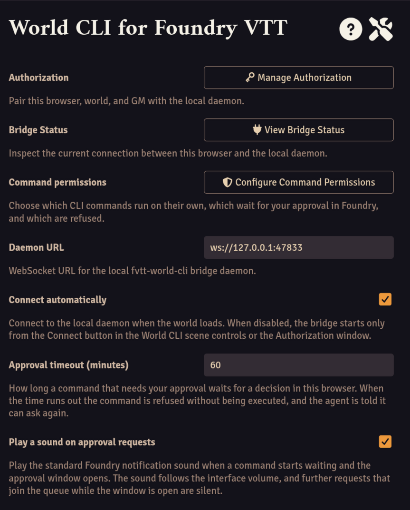
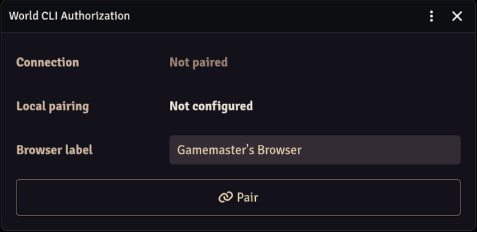

# Getting started

## Before you begin

You need Node.js 20 or newer, Foundry VTT v13 or v14, and a GM account in the target world.
Install the CLI on the machine where you use your AI agent and GM browser. The Foundry server
can be hosted elsewhere; the bridge runs in your browser.

Install the CLI:

```bash
npm install -g fvtt-world-cli
```

In Foundry's *Install Module* dialog, paste this manifest URL:

```
https://github.com/DroiD16/fvtt-world-cli/releases/latest/download/module.json
```

Enable *World CLI for Foundry VTT* in the target world. The CLI and module must come from the
same release. If either was already installed, follow [Updating](#updating) to bring them into sync.

## 1. Start the daemon

```bash
fvtt-world-cli bridge serve
```

The daemon connects the CLI to your GM browser. By default it listens on
`ws://127.0.0.1:47833` and stays running in this terminal for as long as you use the tool.
Keep the terminal open and use a second terminal for the remaining commands.

With the daemon running, open the world in your GM browser. If the world was already open when
you started the daemon, choose *Connect* in the World CLI scene controls or reload the client.

## 2. Pair the Foundry GM client

Open *Authorization* from the *World CLI* group in the left scene controls. The same window is
available through Configure Settings → Module Settings → World CLI for Foundry VTT.



Enter a *Browser label* that you will recognize in the terminal, then choose *Pair*.



In your second terminal, run:

```bash
fvtt-world-cli auth
```

The command shows the requesting origin, world, GM, browser label, and client id. Check that
these match the browser you just paired. At `Approve pairing request <code>? [y/N]`, type `y`
and press Enter to approve. Any other answer denies the request.

Pairing is saved for this browser, world, and GM; you do not repeat it on each use.

## 3. Check the connection

After pairing approval, the *World CLI* icon in the scene controls turns green. Open *Bridge status*
from the same group to see the connection details. No reload is needed after pairing.

On later runs, start the daemon before opening the world. The browser reconnects automatically
unless you disable *Connect automatically* in the module settings.

## Start working

To give your AI agent the operating instructions, install the packaged skill:

```bash
fvtt-world-cli skill install
```

[Agent skill](skill.md) explains installation options and updates. For manual use, start with the
[common workflows](commands.md#common-workflows).

## Updating

Update the CLI and Foundry module to the same release. Components from different releases refuse
to connect, even when their command lists look the same.

1. Stop the daemon with Ctrl+C in its terminal.
2. Update the CLI:

   ```bash
   npm install -g fvtt-world-cli@latest
   ```

3. Update *World CLI for Foundry VTT* in Foundry's module management screen.
4. Start `fvtt-world-cli bridge serve` again, then open or reload the GM client.
5. Check that the *World CLI* icon is green.

Existing browser pairings remain valid.

## Troubleshooting

Open *Bridge status* first. It shows the daemon URL, connection state, and the reason for a stop.

| What you see | What to do |
|---|---|
| The daemon was unavailable when the world loaded | Start the daemon, then choose *Connect* or reload the GM client. |
| `BRIDGE_BUSY` | Another paired browser holds the connection. Choose *Disconnect* there, then *Connect* in the browser you want to use. Keep the existing pairing. |
| A protocol-version mismatch | Follow [Updating](#updating). The status window identifies the component that needs an update when it can compare the versions. |
| The daemon URL does not match | Set the module's *Daemon URL* to the address printed by `bridge serve`. The defaults already match. |
| *Connect automatically* is disabled | Choose *Connect*, or enable that setting for future world loads. |
| A command waits for GM approval | Answer the Command Approval window in Foundry. The command continues after approval. |
| Unpair cannot reach the daemon | Restore the daemon and retry. *Forget local* removes only the browser's credential; the daemon profile remains until `auth revoke <pairingId>` succeeds. |

If the active browser is unavailable, `fvtt-world-cli bridge release` frees its slot. The released
browser stays stopped until its operator chooses *Connect*.

For pairing management, scripted approval, and profile removal, see
[Authorization commands](commands.md#authorization-commands).
